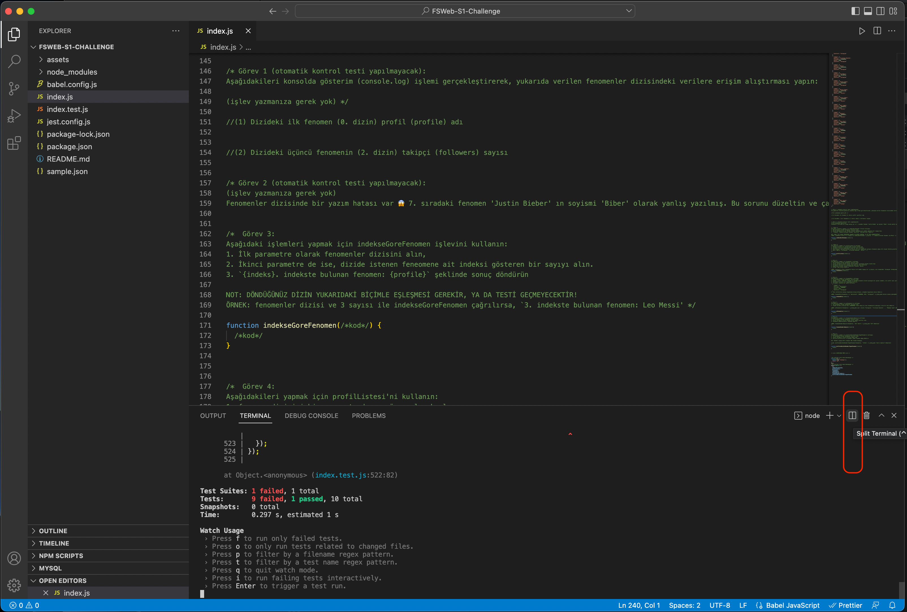
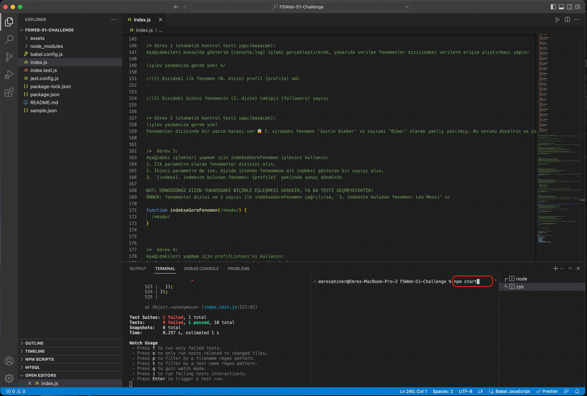
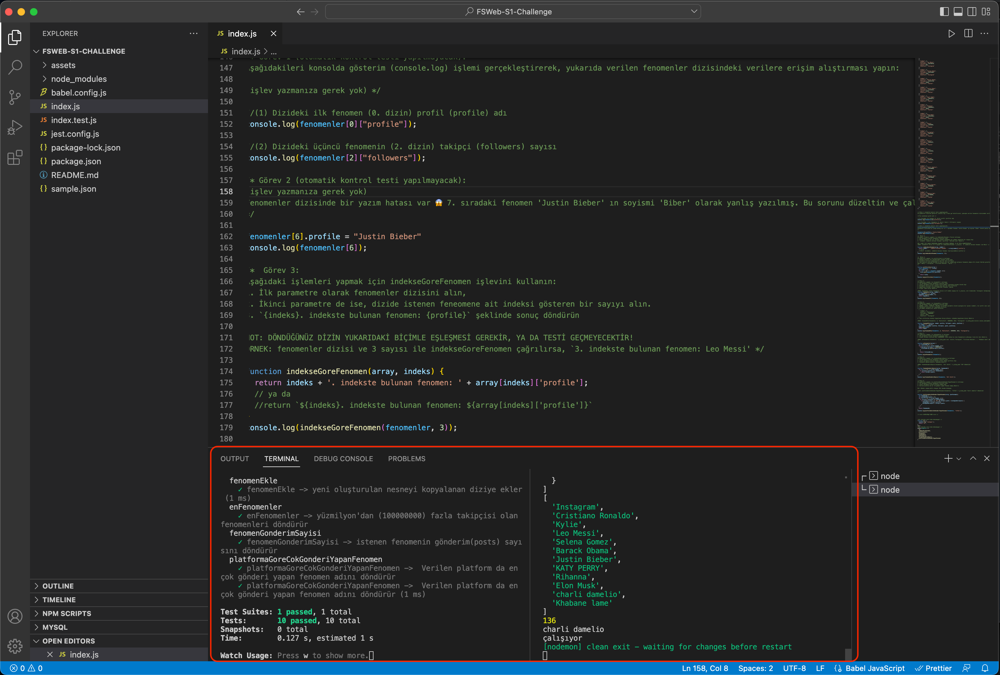

# Challenge - Popüler Sanatçılar
## Giriş

Bu challange'da, "En popüler fenomenler" web sayfası oluşturmak için sosyal medya profillerine ait bir veri seti kullanacaksınız. Bu veriler, [Kaggle](https://www.kaggle.com/datasets/medaxone/top-100-social-media-profiles) adresindeki "En iyi 100 sosyal medya profili" başlıklı Instagram, Twitter, YouTube, Twitch ve TikTok kullanıcıları listesinden gelmektedir. Çalışmayı kolaylaştırmak için, bu verilerden YouTube hariç her birinden ilk 5 profil alınacak şekilde, toplam 20 fenemen profili kullanılacaktır.

## Talimatlar

### Görev 1: Proje Kurulumu

VSCode ve Komut Satırını Kullanma:

1. Bu repo'yu fork'layın
2. Frok'ladığınız repo'yu bilgisayarınızda clone'layın
3. LÜTFEN BRANCH OLUŞTURMAYINIZ! Bu projede main branch'ine push'layacaksın
4. Repo'nuzun olduğu klasöre gidin (`cd REPO_ADI`)
5. Vs code'da terminali açın ve `npm install` yazın ve çalıştırın
6. Sonra `npm run test` yazın ve çalıştırın
7. Projenizi tamamladıktan sonra `push` yaparak githuba aktarın

### Görev 2: Yapılması gerekenler

`index.js` dosyasını bulun ve verilen görevleri tamamlayın. Tüm görevleri doğru tamamlayabilirsen 10 testi de tamamladığını göreceksin. 
")

### Test Etme & Debug Yapma

Projenizin içinde "split terminal"i tıklayarak ikinci bir terminal ekranı açın.

Açılan ikinci terminalde `npm start` yazıp çalıştırın.

Bir terminal ekranında testleri çalıştırırken bir diğerinde ise debug yapabileceksin. Kodlarınızda güncelleme yaptıkça ilerlemeyi kontrol için `console.log`u kullanın.

## Kaynaklar
[W3 Schools - JavaScript Arrays](https://www.w3schools.com/js/js_arrays.asp)
[W3 Schools - JavaScript Objects](https://www.w3schools.com/js/js_objects.asp)
